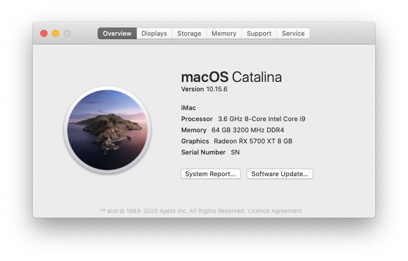

# Hackintosh Opencore 0.6.0 Installation Guide for Gigabyte Z390 Aorus Pro - Catalina(>=10.15.2)
## Using the [Blacklizard repo](https://github.com/blacklizard/gigabyte-z390-aorus-pro-wifi-hackintosh-opencore) as a starting point.
## And completed with this guide from AudioGod [LINK insanelymac site](https://www.insanelymac.com/forum/topic/339980-audiogods-aorus-z390-pro-patched-dsdt-mini-guide-and-discussion/)

### This guide is not intended for beginner, you have been warned. No support is provided unless there is a valid issue. Please read everything before starting

### Hardware

Type|Item
:----|:----
**CPU** | [Intel - Core i9 9900K]
**CPU Cooler** | [Dark Rock Pro]
**Motherboard** | [Gigabyte - Z390 AORUS PRO]
**Memory** | [Corsair Vengance LPX 64GB Kit]
**Storage (macOS)** | [Samsung mSata 1TB]
**Storage (Windows)** | [Samsung Stata 256GB]
**Video Card** | [SAPPHIRE Nitro+ 5700XT SE]
**WiFi + Bluetooth** | TODO: [BCM943602CS](https://www.aliexpress.com/item/32847834498.html) + [PCI-E Adaptor](https://shopee.com.my/product/162227071/3405707076)
**Case** | [Define 7 Compact]
**Power Supply** | [Fractal 870w 80+ Gold Modular]
**Monitor 2** | [DELL 27" 4K]

### Prerequisite 
Please understand all OpenCore configuration by reading [Configuration.pdf](https://github.com/acidanthera/OpenCorePkg/blob/0.5.9/Docs/Configuration.pdf) 

### Required Tools
- [GenSMBIOS](https://github.com/corpnewt/GenSMBIOS)
- [EFI-Agent](https://github.com/headkaze/EFI-Agent)
- [Hackintool](https://github.com/headkaze/Hackintool)

### Step By Step Installation Guide
1. [BIOS configuration](BIOS.md)
2. [macOS installation media](INSTALLER.md)
3. [OpenCore EFI](OC.md)
4. [Post Installation](POST_INSTALL.md)

### Extras
1. [BCM943602CS WIN10 BT/WiFi Driver](https://mega.nz/file/h5ozUZCS#XVszB3yWDcyhaNxahbMWJLiEmnmGpqbuAnahyGDdv7Y)

### What's Working/What's Not

- TO BE VERIFIED - This build is currently under construction...

##### Working
- Ethernet
- Onboard Audio
- HDMI Audio
- DP Audio
- IGPU in headless mode
- App Store
- Wake/Sleep
- Restart
- Shutdown
- USB (Correct SS/HS speed)
- All DP and HDMI port
- Dual monitor from boot
- Apple Music (iTunes)
- iMessage
- Facetime
- Handoff
- Airdrop
- Continuity
- AirPlay
- Apple TV+ - Only works on monitor@**DP**
- Netflix in Safari - Monitor **MUST** be connected via **DP**, for multi monitor setup, **ALL** monitor **MUST** be connected via **DP**. **DO NOT USE HDMI**

##### Not Tested
- FileVault
- Power Nap

##### Not Working
- Built-in WiFi and Bluetooth. This will never work, dont even waste time here. If you absolutely need Bluetooth and WiFi, get the BCM94360CS2 card.
