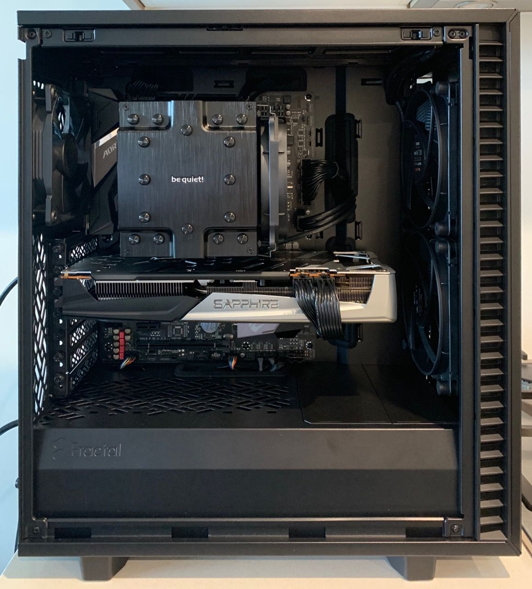

# [Opencore 0.6.0](https://dortania.github.io/OpenCore-Install-Guide/) - Gigabyte Z390 Aorus Pro - Catalina 10.15.6
## Using the [Blacklizard repo](https://github.com/blacklizard/gigabyte-z390-aorus-pro-wifi-hackintosh-opencore) as a starting point.
## Completed with the Boss guide from AudioGod: [LINK insanelymac site](https://www.insanelymac.com/forum/topic/339980-audiogods-aorus-z390-pro-patched-dsdt-mini-guide-and-discussion/) - Install of OS worked first time, and then minor adjustments and tweaks to further customise.
## Additional Tips from [cmer](https://github.com/cmer/gigabyte-z390-aorus-master-hackintosh) - [CFG Lock](https://www.youtube.com/watch?v=W4JXVNJsK98)

### This is not a guide.

## [The Hardware](https://au.pcpartpicker.com/b/BYQqqs)

Type|Item
:----|:----
**CPU** | Intel - Core i9 9900K
**CPU Cooler** | Dark Rock Pro
**Motherboard** | Gigabyte - Z390 Aorus Pro - ATX - LGA 1151
**Memory** | Corsair Vengance LPX 64GB Kit (DDR4-3200 CL16)
**Storage (macOS)** | Samsung 860 Evo 1TB M.2-2280 SSD
**Storage (Windows)** | Samsung Sata 250GB
**Video Card** | Sapphire Radeon RX 5700 XT 8GB Nitro+ SE
**Case** | Fractal Define 7 Compact
**Power Supply** | Fractal Design Ion+ 860W 80+ Platinum ATX Modular
**Monitor** | DELL 27" 4K
TO ADD:
**WiFi + Bluetooth** | [BCM943602CS](https://www.aliexpress.com/item/32847834498.html) + [PCI-E Adaptor](https://shopee.com.my/product/162227071/3405707076)

### Prerequisite:
<u>READ THE DOCS</u> 
Understand all OpenCore configuration by reading their docs: [Link](https://dortania.github.io/OpenCore-Install-Guide/) 
For this exact build: [Link](https://www.insanelymac.com/forum/topic/339980-audiogods-aorus-z390-pro-patched-dsdt-mini-guide-and-discussion/) 
Understanding CFG Lock: [Link](https://www.youtube.com/redirect?event=video_description&v=W4JXVNJsK98&redir_token=QUFFLUhqbjA0ckdvZjd3NHIzVVpFcVdGdS1UekZCWi1qd3xBQ3Jtc0trakZnRkNaMVJIWnEwd1VTelY5NEVjQWstWEJOTmVYdUFmTGlIVF9LcVZDZzhrU1NWTDUtOWUtYkxEMmFqVk0yT1B3RzQ5RS1CRlRZcUVQNk5Td2NFWFRyWkdHbTJmcGdTX0djZmtneTJNMVNfTkswRQ%3D%3D&q=https%3A%2F%2Fdortania.github.io%2FOpenCore-Desktop-Guide%2Fextras%2Fmsr-lock.html) 

### Required Tools and Files
- [audiogod](https://www.insanelymac.com/forum/topic/339980-audiogods-aorus-z390-pro-patched-dsdt-mini-guide-and-discussion/) - Gets you 95% there if using exact same hardware
- [GenSMBIOS](https://github.com/corpnewt/GenSMBIOS) - Used for generating your serial numbers.
- [UEFITool](https://www.youtube.com/redirect?event=video_description&v=W4JXVNJsK98&redir_token=QUFFLUhqbGlfcTh1ZVNsRFVoQmUxdXp6a0NEV2pqNjZTd3xBQ3Jtc0trdHVhejV6TWxNbGZ6UWJPM1UybTFrcjNIT01Yc2YzcHJhV2NYVlU1YmFBQjJjbjVXNHg4VE1TZFhscEwycDNrVDgxal9aZS1pTTl6ODVWYm84VkRSUllyZHh6RTVsd0ZOMkt4d1NmRmNjSW9RRzlEMA%3D%3D&q=https%3A%2F%2Fgithub.com%2FLongSoft%2FUEFITool%2Freleases) - Find and extract bin from firmware file
- [IFRExtractor](https://www.youtube.com/redirect?event=video_description&v=W4JXVNJsK98&redir_token=QUFFLUhqbkVDMzhmYndYNmZUSHk3bFpzRHZnQ2t4N3I4UXxBQ3Jtc0tuS3pwMnNPdWVXY1ptbzNadDhTeEhqRDNqSW1DTjFrUnZJVzhnb0VFOEF3dXMtSmJOTzZBWlhfV2F5SkRua1ZJbUFHcXVwTVRLQmNXaFkxUTI1OEJGbTFqZC1kVTAyTUFrc21WN1VaN0NDZFhzTFFwdw%3D%3D&q=https%3A%2F%2Fgithub.com%2FLongSoft%2FUniversal-IFR-Extractor%2Freleases) - convert binary to .txt file
- [MountEFI](https://www.youtube.com/redirect?event=video_description&v=W4JXVNJsK98&redir_token=QUFFLUhqbEZoYUlvMG9UUGVGM01FcmFtZG1QSnM1aFVpZ3xBQ3Jtc0trS015bThkTUJZUmZ6WHhtM2c3c0lTSmhpZTRfM29WYU9LSkd1Y1dJdU5fNnBlSzlHQUduelJwdVVTSVFrWmtiejdJbkhrZVVvMF9DVUF5dTc2UFI3bXNNczFMODVvREZMbHJmWS1DODZucTRxUDdrbw%3D%3D&q=https%3A%2F%2Fgithub.com%2Fcorpnewt%2FMountEFI) - Mounts your hidden EFI partition

### Step By Step Installation Guide
1. [BIOS configuration](BIOS.md)
2. [macOS installation media](INSTALLER.md)
3. [OpenCore EFI](OC.md)
4. [Post Installation](POST_INSTALL.md)

### Extras
1. [BCM943602CS WIN10 BT/WiFi Driver](https://mega.nz/file/h5ozUZCS#XVszB3yWDcyhaNxahbMWJLiEmnmGpqbuAnahyGDdv7Y)

### What's Working/What's Not

- This build is currently under construction...

##### Working
- Ethernet
- Onboard Audio
- IGPU in headless mode
- App Store
- Wake/Sleep
- Restart
- Shutdown
- USB (Correct SS/HS speed)
- iMessage

##### Not Tested

##### Not Working

